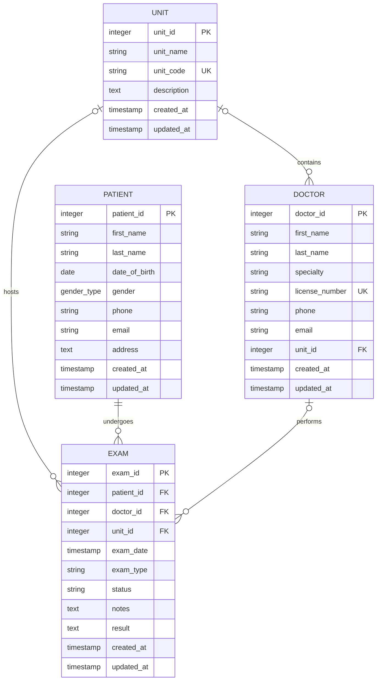

# Dummy Hospital API

Initial FastAPI backend scaffold for the Dummy Hospital application.


## Docker Compose setup

### Requirements
- Docker with Compose (optional containerized setup)

### Setup commands
Build the application image and start the API and PostgreSQL services:

```bash
cp .env.example .env
# Edit .env and replace each <...> placeholder before continuing.
```

Use the Makefile command to build and start the services:

```bash
make compose-up
```

The application source is bind-mounted into the container, and Uvicorn reloads when Python
files change. The application is available at `http://localhost:<APP_PORT>`, using the value
configured in `.env`. PostgreSQL is exposed on the configured `POSTGRES_PORT` for host-side
tools, and the application image includes the `psql` client.

The schema dump is loaded only when the PostgreSQL data volume is first created. To discard the
database and initialize it again:

```bash
docker compose down --volumes
docker compose up --build
```

Configure `COMPOSE_PROJECT_NAME`, `APP_PORT`, `APP_UID`, `APP_GID`, `POSTGRES_PORT`, and
`POSTGRES_PASSWORD` in `.env`. Choose a unique project name and host ports when sharing a Docker
daemon with other users.

The source bind mount makes the host `.env` file available to the application at `/app/.env`.
Pydantic Settings reads that file, but process environment variables take precedence over its
values. The app service therefore injects its own `DATABASE_URL`, replacing the host-oriented
URL from `.env` with one that uses the `dummy_hospital_db` service name and PostgreSQL's internal
port `5432`. `POSTGRES_PORT` only controls the port exposed on the host.

## Local setup

### Requirements

- Python 3.12 or newer
- PostgreSQL
- [uv](https://docs.astral.sh/uv/)
- Make (optional convenience wrapper for development commands)

### Setup commands
```bash
cp .env.example .env
uv sync --extra dev
uv run uvicorn dummy_hospital.main:app --reload
```

Replace every placeholder in `.env` with values appropriate for your local environment.


## Endpoints

- `GET /healthz` checks application liveness without accessing PostgreSQL.
- `GET /readyz` executes `SELECT 1` against PostgreSQL and returns HTTP 503 if it is unavailable.
- `GET /api/v1/doctors`, `/patients`, `/units`, and `/exams` return paginated resource
  lists and accept `limit` and `offset` query parameters.
- Interactive OpenAPI documentation is available at `/docs` while the application is running.

## Database schema



Foreign-key deletion behavior is documented in [docs/database.md](docs/database.md).

## Development checks

```bash
make check
```

The individual commands are `make lint`, `make typecheck`, and `make test`. Without Make,
run the corresponding `uv run ruff check .`, `uv run mypy dummy_hospital scripts tests`, and
`uv run pytest` commands directly.

### Dummy data

Populate an empty non-production database with deterministic fictional data through the
SQLAlchemy ORM:

```bash
uv run python scripts/seed_database.py
```

The defaults create 8 units, 20 doctors, 100 patients, and 200 exams with Faker seed `42`.
Counts and the seed can be overridden, and a dry run flushes all objects to validate database
constraints before rolling the transaction back:

```bash
uv run python scripts/seed_database.py \
  --seed 123 --units 4 --doctors 10 --patients 50 --exams 100 --dry-run
```

The seeder refuses to run when `APP_ENV=production`, when any application table already has
rows, or when the requested total exceeds 100,000 objects. Concurrent seeder invocations are
serialized with a transaction-scoped PostgreSQL advisory lock. Normal execution commits all
objects in one transaction; any failure rolls the entire transaction back. The target summary
hides the database password. PostgreSQL sequence values are non-transactional, so a dry run can
advance ID sequences even though its rows are rolled back.

### PostgreSQL integration tests

Integration tests use the database configured by `TEST_DATABASE_URL` and skip when it is not
configured. A dedicated test database is strongly recommended. To create one, an administrator
must create the database with the application role as owner before that role loads the schema:

```bash
createdb --owner=dummy_hospital dummy_hospital_test  # run as a PostgreSQL administrator
psql -h localhost -U dummy_hospital -d dummy_hospital_test \
  -f db_dump/dummy_hospital_schema_1.sql
# TEST_DATABASE_URL=postgresql+asyncpg://.../dummy_hospital_test
uv run pytest -m integration
```

Each test runs in a transaction that is rolled back. The current `dummy_hospital` role does
not have permission to create databases, so database creation requires an administrator.

## Database migrations

Alembic is configured, but there are intentionally no revisions yet. Do not run
autogeneration until the SQLAlchemy models reproduce the existing PostgreSQL
schema exactly. See [docs/database.md](docs/database.md).

The original schema dump under `db_dump/` is reference material and must not be
edited by application tooling.
